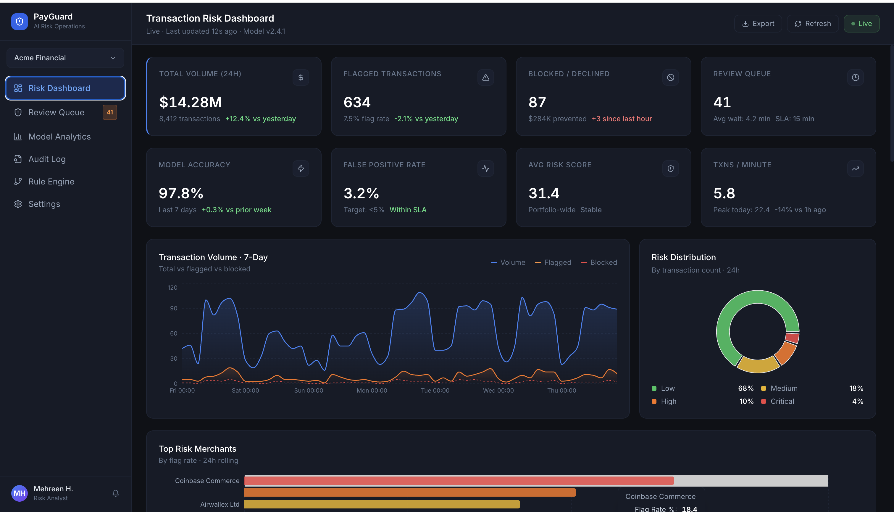
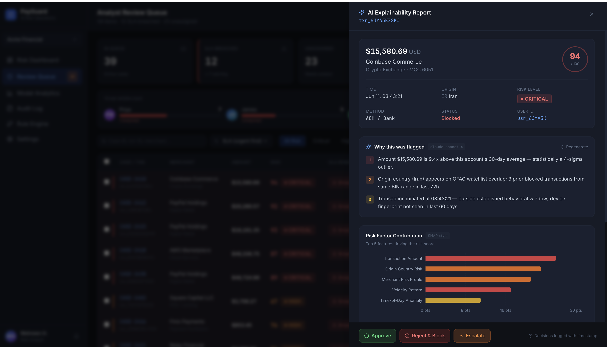
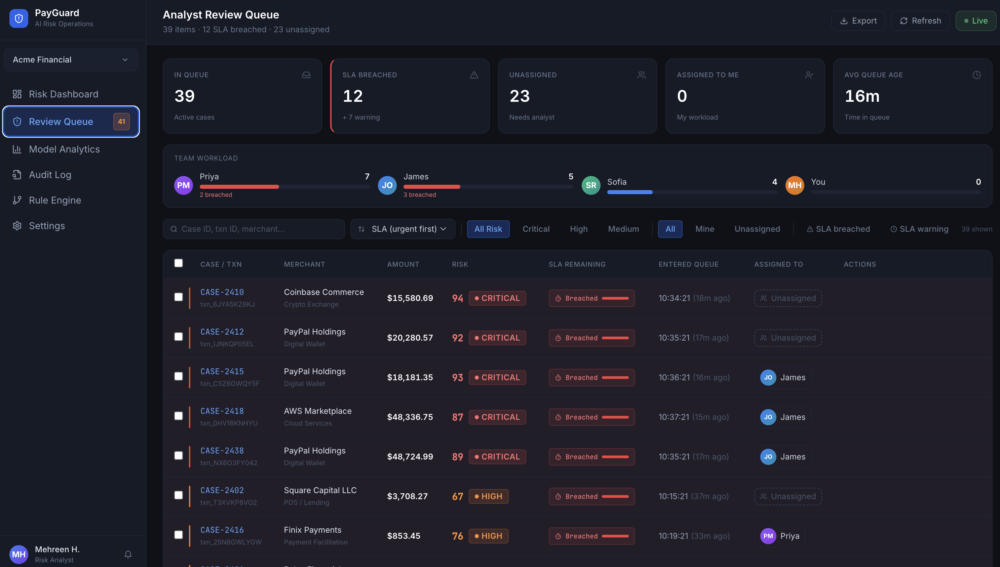
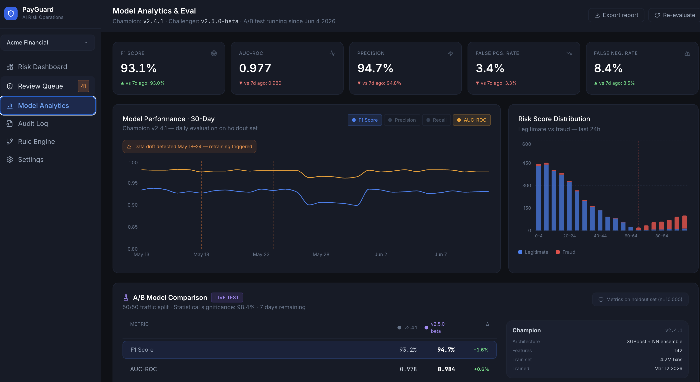

# PayGuard AI

> **Real-time payments fraud detection with AI-powered explainability — built for neobank fraud operations teams.**

[](https://payguard-ai-sigma.vercel.app)
[](https://eur-lex.europa.eu/legal-content/EN/TXT/?uri=CELEX:32024R1689)
[](https://anthropic.com)
[](https://react.dev)

## Screenshots

### Transaction Risk Dashboard


### Explainability Panel — EU AI Act Article 13


### Analyst Review Queue


### Model Analytics & Eval Dashboard

---

## The Problem

Neobanks like N26 and Revolut process millions of transactions daily through ML fraud models — but face two compounding problems:

1. **High false positive rates** — legitimate transactions blocked, destroying customer trust
2. **Black-box decisions** — when a transaction IS flagged, neither the customer nor the analyst understands why — violating EU AI Act Article 13 transparency requirements

Fraud analysts spend 60%+ of their shift reviewing transactions with no context beyond a single risk score. Manual review takes 4+ minutes per case. SLA breaches pile up. Model drift goes undetected.

**PayGuard AI solves all three.**

---

## What It Does

PayGuard AI is a fraud operations platform that combines real-time ML risk scoring with Claude-powered natural language explanations, a human-in-the-loop review workflow, and a production eval dashboard — built to the standard of what N26's Intelligent Operations Platform and Revolut's Core Payments AI team are building internally.

---

## Live Demo

**[payguard-ai-sigma.vercel.app](https://payguard-ai-sigma.vercel.app)**

| Screen | Route | Description |
|---|---|---|
| Transaction Risk Dashboard | `/` | Live feed, KPIs, 7-day volume chart, risk distribution |
| Analyst Review Queue | `/queue` | SLA-tiered queue, bulk actions, team workload |
| Model Analytics | `/analytics` | Eval metrics, A/B comparison, threshold tuner, EU AI Act compliance |
| Explainability Panel | Click any flagged transaction | Claude-powered NL explanation + SHAP chart + Article 13 badge |

---

## Key Features

### Transaction Risk Dashboard
- Real-time transaction feed with risk scores (0–100)
- Auto-approved / Review / Blocked status with color coding
- KPI strip: Total Volume (24h), Flagged Rate, False Positive Rate (primary metric), Model Accuracy, Transactions/min
- 7-day volume chart (Volume vs Flagged vs Blocked) — Recharts
- Risk distribution donut (Low / Medium / High / Critical)
- Top Risk Merchants by flag rate

### Explainability Panel (EU AI Act Article 13)
- Slides in on any flagged transaction click
- **Claude API** (`claude-sonnet-4-20250514`) generates fraud-analyst-specific explanation in plain English — 3 numbered bullets with severity colour coding
- SHAP-style horizontal bar chart — 6 features: Transaction Amount, Origin Country Risk, Merchant Risk Profile, Velocity Pattern, Time-of-Day Anomaly, Device/IP Signals
- Triggered signals from the underlying rule engine
- **EU AI Act Article 13 compliance badge** — every explanation logged for regulatory audit
- Analyst actions: Approve / Reject & Block / Escalate — two-tap confirm flow, all decisions written to Supabase

### Analyst Review Queue
- SLA countdown per case (green → amber → red as deadline approaches)
- KPIs: Queue depth, SLA breached, unassigned, avg case age
- Team workload bar — per-analyst capacity, turns red when breached
- Filters: search by case/txn ID, sort by SLA urgency / risk score / age / amount, risk level chips
- Bulk actions: select multiple → Approve all / Reject all / Escalate all / Assign to me
- Row-level quick actions: Claim, Review, quick-approve ✓, quick-reject ✗
- Opens Explainability Panel in-place — full AI context without leaving the queue

### Model Analytics & Eval Dashboard
- **KPI row:** F1 Score, AUC-ROC, Precision, False Positive Rate, False Negative Rate — each with 7-day delta trend
- **30-day performance chart** — multi-line (F1, Precision, Recall, AUC-ROC), data drift annotation band, retraining markers
- **Risk score distribution** — stacked bar (legitimate vs fraud by score bucket) with decision boundary reference line
- **A/B Model Comparison** — Champion v2.4.1 (XGBoost+NN) vs Challenger v2.5.0-beta (Transformer+XGBoost) — side-by-side metrics table with Δ% column, 14-day F1 lift chart, preliminary verdict
- **Confusion Matrix** — switchable Champion/Challenger, TP/TN/FP/FN with % of sample
- **Decision Threshold Tuner** — live slider τ=0.10→1.00, Precision/Recall/F1 update in real time, PR curve with reference line
- **EU AI Act Compliance Score** — SVG donut (87/100), expandable rows for Articles 9, 10, 13, 14, 17, 62

---

## Tech Stack

| Layer | Technology |
|---|---|
| Frontend | React 18 + Tailwind CSS |
| Charts | Recharts |
| AI Explanations | Claude API (`claude-sonnet-4-20250514`) |
| Database | Supabase (Postgres + RLS) |
| Icons | Lucide React |
| Build | Vite |
| Deploy | Vercel |

---

## Architecture

```
┌─────────────────────────────────────────────────────────┐
│                    PayGuard AI                          │
├─────────────────────────────────────────────────────────┤
│  React Frontend (Vite + Tailwind)                       │
│  ┌──────────┐ ┌──────────┐ ┌──────────┐ ┌──────────┐  │
│  │Dashboard │ │ Queue    │ │Analytics │ │Explain   │  │
│  │Screen 1  │ │Screen 3  │ │Screen 4  │ │Panel S2  │  │
│  └──────────┘ └──────────┘ └──────────┘ └──────────┘  │
├─────────────────────────────────────────────────────────┤
│  Data Layer                                             │
│  ┌─────────────────────┐  ┌──────────────────────────┐ │
│  │ Synthetic Transaction│  │ Claude API               │ │
│  │ Generator (PaySim   │  │ NL Explanation Engine    │ │
│  │ -style, 8,400+ tx/d)│  │ (Article 13 compliant)   │ │
│  └─────────────────────┘  └──────────────────────────┘ │
│  ┌─────────────────────────────────────────────────────┐│
│  │ Supabase (Postgres)                                 ││
│  │ analyst_decisions | audit_log | model_versions      ││
│  └─────────────────────────────────────────────────────┘│
└─────────────────────────────────────────────────────────┘
```

---

## Getting Started

### Prerequisites
- Node.js 18+
- Anthropic API key ([console.anthropic.com](https://console.anthropic.com))
- Supabase project (optional — app works without it, decisions won't persist)

### Setup

```bash
# Clone
git clone https://github.com/mehreenhimani/payguard-ai.git
cd payguard-ai

# Install
npm install

# Configure environment
cp .env.example .env.local
```

Edit `.env.local`:
```
VITE_ANTHROPIC_API_KEY=sk-ant-...        # Required for live AI explanations
VITE_SUPABASE_URL=https://...            # Optional — for decision persistence
VITE_SUPABASE_ANON_KEY=...              # Optional
```

```bash
# Run
npm run dev
```

Open `http://localhost:5173`

### Build for Production
```bash
npm run build
# Output in /dist
```

---

## Database Schema

| Table | Description |
|---|---|
| `analyst_decisions` | Every approve/reject/escalate action with timestamp, analyst ID, transaction ID, note |
| `audit_log` | EU AI Act Article 13 compliance log — every AI explanation generated |
| `model_versions` | A/B test tracking — Champion vs Challenger performance over time |

Row Level Security (RLS) enabled on all tables.

---

## Project Structure

```
payguard-ai/
├── src/
│   ├── components/         # Shared UI (Sidebar, KPICard, RiskBadge, Toast)
│   ├── pages/
│   │   ├── Dashboard.jsx   # Screen 1 — Transaction Risk Dashboard
│   │   ├── Queue.jsx       # Screen 3 — Analyst Review Queue
│   │   ├── Analytics.jsx   # Screen 4 — Model Eval Dashboard
│   │   └── ExplainPanel.jsx # Screen 2 — Explainability Panel
│   ├── lib/
│   │   ├── claude.js       # Claude API client
│   │   ├── supabase.js     # Supabase client
│   │   └── transactions.js # Synthetic transaction generator
│   └── App.jsx
├── supabase/
│   └── migrations/         # SQL schema files
├── docs/
│   ├── PRD.md              # Full product requirements
│   ├── architecture.md     # System design
│   └── eval-dataset.md     # 50 golden test transactions
├── CLAUDE.md               # Claude Code project context
└── .env.example
```

---

## EU AI Act Compliance

PayGuard AI is designed to meet **EU AI Act (Regulation 2024/1689)** requirements for high-risk AI systems in financial services:

| Article | Requirement | Status |
|---|---|---|
| Article 9 | Risk management system | ✅ Model drift detection, threshold alerts |
| Article 10 | Data governance | ✅ Synthetic data with documented generation methodology |
| Article 13 | Transparency & explainability | ✅ Every flagged decision explained in natural language, logged |
| Article 14 | Human oversight | ✅ Analyst review queue with override capability |
| Article 17 | Quality management | ✅ A/B testing, confusion matrix, eval dashboard |
| Article 62 | Incident reporting | ✅ Audit log with full decision trail |

**Compliance Score: 87/100** (as shown in Model Analytics screen)

---

## Eval Methodology

PayGuard AI includes a production-grade evaluation framework:

- **Golden test set:** 50 hand-labelled transactions (25 fraud, 25 legitimate) covering edge cases
- **Primary metric:** False Positive Rate (FPR) — minimising legitimate transaction blocks
- **Secondary metrics:** F1, Precision, Recall, AUC-ROC
- **A/B testing:** Champion vs Challenger model comparison with statistical significance tracking
- **Model drift detection:** 7-day rolling performance, annotated drift windows with retraining triggers
- **Decision threshold tuner:** Live PR curve — analysts can adjust the operating point based on risk appetite

---

## Product Context

This project was built as a capstone to demonstrate AI PM skills directly relevant to:

- **N26** — Intelligent Operations Platforms (IOP) segment, AI Products team
- **Revolut** — Core Payments + Financial Crime AI teams
- **Stripe** — Radar fraud product

It addresses real pain points documented in Revolut's September 2025 OCC/Fed/FDIC submission on payments fraud, and N26's publicly stated mandate to build AI capabilities that serve every part of the bank — from Financial Crime to Risk to Growth.

---

## Related Projects

| Project | Description | Live |
|---|---|---|
| [ComplianceIQ](https://github.com/mehreenhimani/complianceiq) | AML triage platform — UBS Actimize-inspired | [Live](https://complianceiq-aml-triage.vercel.app/dashboard) |
| [RegCopilot](https://github.com/mehreenhimani/regcopilot) | EU regulatory document Q&A (EU AI Act, DORA, AMLD6, GDPR) | [Live](https://regcopilot.lovable.app) |
| [PulseAI](https://github.com/mehreenhimani/pulseai) | AI product intelligence — feedback → PRD generation | [Live](https://pulseai-kohl.vercel.app) |

---

## About the Author

**Mehreen Himani** — Senior AI Product Manager with 13+ years in regulated financial services (Credit Suisse, UBS, Standard Chartered, Capgemini/CARIAD).

Specialist in AML/compliance AI, EU AI Act, and sprint-level AI product delivery.

[LinkedIn](https://linkedin.com/in/mehreenhimani) · [Portfolio](https://mehreens-ai-story.lovable.app) · [GitHub](https://github.com/mehreenhimani)

---

## License

MIT